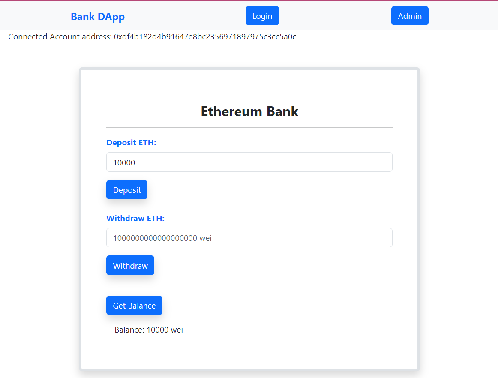

# Ethereum-Bank-DApp





Decentralised Bank App built on Ethereum and deploted on Sepolia Testnet

## Table of Contents
- [Getting Started](#getting-started)
  - [Built with](#built-with)
  - [Prerequisites](#prerequisites)
- [Run DApp](#run-dapp)
- [Credits](#credits)
- [License](#license)

## Getting Started
Follow these steps to get the dapp running on your local machine <br>

## Built With
- [HTML](https://www.w3schools.com/html/html_intro.asp) - Used for creating structure of the webpage
- [Bootstrap](https://getbootstrap.com/) - Bootstrap is an open source toolkit for developing with HTML, CSS, and JS.
- [Nodejs](https://nodejs.org/en) - It is used as backend and run the server for DApp
- [Solidity](https://docs.soliditylang.org/en/v0.8.23/) - Solidity is a programming language used to build smart contracts on EVM based blockchains.
- [Remix IDE](https://remix.ethereum.org/) - It is an IDE used to test/debug/develop/deploy solidity smart contracts.
- [Web3j](https://github.com/web3j/web3j) - It is a library to interact with smart contracts from javascript application
- [Metamask](https://metamask.io/) - It is a crypto wallet used to send/receive crypto assessts as well as sign the transactions while interacting with DApps

## Prerequisites
1. Check if node is installed and up-to-date 
    ```
    node -v
    npm -v
    ```

2. Install metamask browser extension from (https://metamask.io/)

3. Have sufficient Sepolia Ethers in your metamask wallet <br>
   You can get free test Ethers from (https://sepoliafaucet.com/)

## Run DApp
1. Fork this repo by clicking **Fork** button in top-right corner of this web page. Continue to follow instruction steps from your own ethereum-bank-dapp repo.
   
2. Clone your own ethereum-bank-dapp repo. Copy the link from the "Clone or download" button near the top right of this repo's home page. <br>
*(You can even clone this repo without forking it, so you can skip step 1)*

3. After cloning use this command to install all the required modules
    ```
    cd ethereum-bank-dapp
    npm install
    ```

4. Run the dapp using this command
   ```
   node server.js 
   ```

You can check for the deployed smart contract here (https://sepolia.etherscan.io/address/0xe1cF6d7343e9660c77b02aF664135c94d8fa67D6)

## Credits
Dapp World <br>
[Ganesh Deshpande CTO, DApp World](https://www.linkedin.com/in/ganesh-deshpande-3477b9169/) <br><br>
[Course Link](https://dapp-world.com/course/ethereum-dapp-development-beginner-T2QL) - Ethereum DApp Development : Beginner

[My dapp-world profile](https://dapp-world.com/soul/Shoydon)

## License
MIT